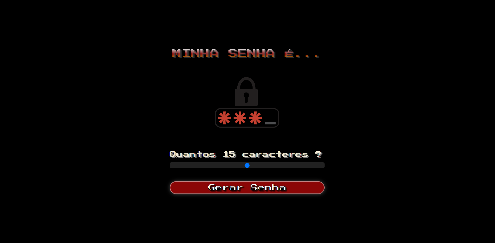
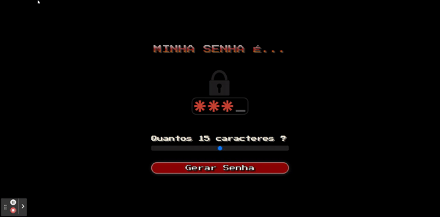

# MINHA SENHA É... - Gerador de Senha

Deploy do projeto: <https://minha-senha.vercel.app/>

## Sobre

É um site que cria senhas complexas para ajudar no dia a dia das pessoas que desejam criar senhas mais seguras.

### Objetivo

Desenvolver minhas habilidades de JavaScript trabalhando com algoritimo no JavaScript e CSS.

### Desafio

Meu desafio foi desenvolver no JavaScript, compreendendo como escrever um algoritmo que cria senhas aleatórias. É a primeira vez que desenvolvo nesse foco e portanto tive o auxílio de alguns códigos nas internet. 

### Conclusão

Fiquei muito empolgado em desenvolver mais com JavaScript. Já tinha o conhecimento do curso da Alura, mas nesse projeto me senti mais confiante. No próximo projeto irei trabalhar mais com algoritmos e também praticar mais o React.

### Ferramentas Utilizadas

- HTML
- CSS
- JavaScript